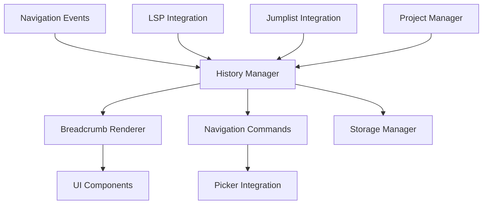

# Design Document

## Overview

The nvim-navigation-breadcrumbs plugin extends Neovim's built-in navigation capabilities with a visual breadcrumb system that tracks navigation history and provides enhanced code exploration features. The design prioritizes integration with existing Neovim functionality, performance, and minimal visual intrusion.

The plugin will be implemented as a Lua-based Neovim plugin that hooks into existing navigation events, maintains efficient in-memory data structures for history tracking, and provides both visual breadcrumbs and enhanced navigation commands.

## Architecture

### Core Components



### Plugin Structure

```
lua/
├── nvim-navigation-breadcrumbs/
│   ├── init.lua              -- Main plugin entry point
│   ├── config.lua            -- Configuration management
│   ├── history/
│   │   ├── manager.lua       -- Core history tracking logic
│   │   ├── storage.lua       -- Persistence and pruning
│   │   └── events.lua        -- Navigation event handling
│   ├── ui/
│   │   ├── breadcrumbs.lua   -- Visual breadcrumb rendering
│   │   ├── preview.lua       -- Code preview functionality
│   │   └── picker.lua        -- Integration with mini.pick
│   ├── navigation/
│   │   ├── commands.lua      -- Enhanced navigation commands
│   │   ├── lsp.lua           -- LSP integration hooks
│   │   └── jumplist.lua      -- Jumplist enhancement
│   └── utils/
│       ├── project.lua       -- Project detection and management
│       └── performance.lua   -- ~~Performance monitoring utilities~~ (Edit: there should not be custom performance measurement tooling beyond what is necessary for the app to function)
(Edit: there should be a directory for tests)
```

## Components and Interfaces

### History Manager

**Purpose**: Central component that tracks navigation history, manages branching paths, and handles pruning.

**Key Interfaces**:
```lua
-- Core history tracking
history_manager.record_jump(from_location, to_location, jump_type)
history_manager.get_current_trail()
history_manager.navigate_to_index(index)

-- Branch management
history_manager.create_branch(from_index)
history_manager.get_active_branches()
history_manager.switch_branch(branch_id)

-- Pruning and cleanup
history_manager.prune_old_entries(max_age)
history_manager.prune_inconsequential_jumps()
```

### Breadcrumb Renderer

**Purpose**: Handles visual display of navigation breadcrumbs with minimal screen real estate usage.

**Key Interfaces**:
```lua
-- Display management
breadcrumbs.show()
breadcrumbs.hide()
breadcrumbs.toggle()
breadcrumbs.update_display(trail)

-- Visual styling
breadcrumbs.set_highlight_groups()
breadcrumbs.configure_display_options(opts)
```

### Navigation Commands

**Purpose**: Provides enhanced navigation commands that extend Neovim's built-in functionality.

**Key Interfaces**:
```lua
-- Enhanced navigation
commands.go_back(count)
commands.go_forward(count)
commands.jump_to_history_item(index)

-- Quick selection
commands.show_history_picker()
commands.show_branch_picker()
```

### LSP Integration

**Purpose**: Hooks into LSP events to track definition jumps, references, and implementations.

**Key Interfaces**:
```lua
-- LSP event hooks
lsp_integration.on_definition_jump(from_pos, to_pos)
lsp_integration.on_references_found(locations)
lsp_integration.on_implementation_jump(from_pos, to_pos)

-- Enhanced LSP commands
lsp_integration.enhanced_go_to_definition()
lsp_integration.enhanced_find_references()
```

## Data Models

### Navigation Entry

```lua
NavigationEntry = {
  id = string,              -- Unique identifier
  file_path = string,       -- Absolute file path
  position = {              -- Cursor position
    line = number,
    column = number
  },
  timestamp = number,       -- Unix timestamp
  jump_type = string,       -- "manual", "lsp_definition", "lsp_reference", etc.
  context = {               -- Surrounding code context
    before_lines = table,   -- Lines before cursor
    after_lines = table,    -- Lines after cursor
    function_name = string, -- Current function (if available)
  },
  project_root = string,    -- Project root directory
  branch_id = string,       -- Branch identifier for navigation paths
}
```

### Navigation Trail

```lua
NavigationTrail = {
  entries = table,          -- Array of NavigationEntry
  current_index = number,   -- Current position in trail
  branches = table,         -- Map of branch_id to branch metadata
  project_root = string,    -- Associated project root
  created_at = number,      -- Trail creation timestamp
  last_accessed = number,   -- Last access timestamp
}
```

### Configuration Schema

(Edit: minimize the supported configuration to only the absolute necessary and rely on good defaults)

```lua
Config = {
  -- Display options
  display = {
    enabled = boolean,      -- Default: true
    max_items = number,     -- Default: 10
    auto_hide = boolean,    -- Default: true
    position = string,      -- "top", "bottom", "floating"
  },
  
  -- History management
  history = {
    max_entries = number,   -- Default: 1000
    max_age_minutes = number, -- Default: 30
    prune_threshold = number, -- Default: 100
    save_on_exit = boolean, -- Default: false
  },
  
  -- Integration settings
  integration = {
    jumplist = boolean,     -- Default: true
    lsp = boolean,          -- Default: true
    telescope = boolean,    -- Default: true
  },
  
  -- Performance settings
  performance = {
    debounce_ms = number,   -- Default: 50
    max_preview_lines = number, -- Default: 20
  }
}
```

## Error Handling

### Error Categories

1. **File System Errors**: Handle cases where files are moved, deleted, or become inaccessible
2. **LSP Errors**: Graceful degradation when LSP is unavailable or returns errors
3. **Performance Errors**: Handle memory pressure and excessive history growth
4. **Configuration Errors**: Validate and provide defaults for invalid configurations

### Error Handling Strategy

```lua
-- Graceful degradation pattern
local function safe_operation(operation, fallback)
  local success, result = pcall(operation)
  if success then
    return result
  else
    vim.notify("Navigation breadcrumbs: " .. tostring(result), vim.log.levels.WARN)
    return fallback and fallback() or nil
  end
end

-- File accessibility checking
local function validate_file_access(file_path)
  if not vim.fn.filereadable(file_path) then
    -- Remove from history or mark as inaccessible
    return false
  end
  return true
end
```

## Testing Strategy

### Test Framework

The plugin will use `mini.test` as specified in the requirements, focusing on high-signal integration tests rather than exhaustive unit testing.

### Test Categories

1. **Core Functionality Tests**
   - Navigation history recording and retrieval
   - Branch creation and management
   - Pruning algorithms

2. **Integration Tests**
   - LSP integration with go-to-definition
   - Jumplist enhancement
   - Project-aware history separation

3. **UI Tests**
   - Breadcrumb display and hiding
   - Preview pane functionality
   - Picker integration

4. **Performance Tests**
   - Memory usage under large history loads
   - Response time for navigation operations
   - File loading impact measurement

### Test Structure

```lua
-- Example test structure
local T = MiniTest.new_set()

T['navigation history'] = MiniTest.new_set()
T['navigation history']['records jumps correctly'] = function()
  -- Test navigation recording
end

T['navigation history']['handles branching paths'] = function()
  -- Test branch creation and switching
end

T['lsp integration'] = MiniTest.new_set()
T['lsp integration']['enhances go-to-definition'] = function()
  -- Test LSP integration
end
```

### Performance Benchmarks

- Navigation operations must complete within 50ms
- Memory usage should not exceed 10MB for typical usage (1000 entries)
- File loading should not add more than 5ms delay
- History pruning should complete within 100ms

## Implementation Phases

### Phase 1: Core Infrastructure
- Basic history manager implementation
- Simple navigation recording
- Configuration system setup

### Phase 2: Visual Components
- Breadcrumb rendering system
- Basic display toggle functionality
- Integration with Neovim's UI system

### Phase 3: Enhanced Navigation
- LSP integration hooks
- Jumplist enhancement
- Navigation commands implementation

### Phase 4: Advanced Features
- Preview pane functionality
- Picker integration (mini.pick)
- Project-aware history management

### Phase 5: Polish and Optimization
- Performance optimization
- Comprehensive testing
- Documentation and examples