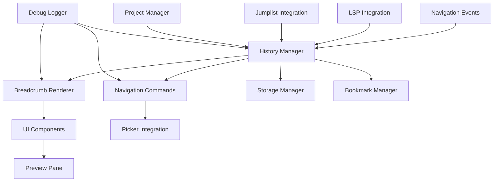

# Design Document

## Overview

The nvim-navigation-breadcrumbs plugin extends Neovim's built-in navigation capabilities with a visual breadcrumb system that tracks navigation history and provides enhanced code exploration features. The design prioritizes integration with existing Neovim functionality, performance, and minimal visual intrusion.

The plugin will be implemented as a Lua-based Neovim plugin that hooks into existing navigation events, maintains efficient in-memory data structures for history tracking, and provides both visual breadcrumbs and enhanced navigation commands.

## Architecture

### Core Components



### Plugin Structure

```
lua/
├── nvim-navigation-breadcrumbs/
│   ├── init.lua              -- Main plugin entry point
│   ├── config.lua            -- Configuration management
│   ├── history/
│   │   ├── manager.lua       -- Core history tracking logic
│   │   ├── storage.lua       -- Persistence and pruning
│   │   ├── events.lua        -- Navigation event handling
│   │   └── bookmarks.lua     -- Sticky bookmarks and frequent locations
│   ├── ui/
│   │   ├── breadcrumbs.lua   -- Visual breadcrumb rendering with collapse/expand
│   │   ├── floating_tree.lua -- Branch history floating window with unicode tree
│   │   ├── preview.lua       -- Code preview functionality
│   │   ├── picker.lua        -- Integration with mini.pick (dual modes)
│   │   └── statusline.lua    -- Branch status display in statusline
│   ├── navigation/
│   │   ├── commands.lua      -- Enhanced navigation commands
│   │   ├── lsp.lua           -- LSP integration hooks
│   │   └── jumplist.lua      -- Jumplist enhancement
│   ├── utils/
│   │   ├── project.lua       -- Project detection and management
│   │   └── debug.lua         -- Debug logging utilities
│   └── tests/
│       ├── history_spec.lua  -- History manager tests
│       ├── ui_spec.lua       -- UI component tests
│       ├── navigation_spec.lua -- Navigation command tests
│       └── integration_spec.lua -- Integration tests
```

## Components and Interfaces

### History Manager

**Purpose**: Central component that tracks navigation history, manages branching paths, and handles intelligent pruning with location recovery.

**Key Interfaces**:
```lua
-- Core history tracking
history_manager.record_jump(from_location, to_location, jump_type)
history_manager.get_current_trail()
history_manager.navigate_to_index(index)

-- Branch management
history_manager.create_branch(from_index)
history_manager.get_active_branches()
history_manager.switch_branch(branch_id)
history_manager.determine_exploration_state()

-- Intelligent pruning with recovery
history_manager.schedule_pruning()  -- Debounced 2-minute delay
history_manager.prune_with_recovery()
history_manager.attempt_location_recovery(entry)
history_manager.mark_unrecoverable(entry)
history_manager.prune_old_entries(max_age)
history_manager.prune_inconsequential_jumps()

-- Location recovery
history_manager.find_shifted_location(entry)
history_manager.update_recovered_position(entry, new_position)
history_manager.preserve_original_reference(entry)
```

### Breadcrumb Renderer

**Purpose**: Handles visual display of navigation breadcrumbs with hotkey-triggered display and collapsible interface.

**Key Interfaces**:
```lua
-- Display management
breadcrumbs.show_on_hotkey()
breadcrumbs.hide()
breadcrumbs.toggle()
breadcrumbs.update_display(trail)

-- Focus and collapse management
breadcrumbs.focus_item(index)
breadcrumbs.collapse_unfocused()
breadcrumbs.expand_neighbors(focused_index)

-- Visual styling
breadcrumbs.set_highlight_groups()
breadcrumbs.configure_display_options(opts)
```

### Navigation Commands

**Purpose**: Provides enhanced navigation commands that extend Neovim's built-in functionality.

**Key Interfaces**:
```lua
-- Enhanced navigation
commands.go_back(count)
commands.go_forward(count)
commands.jump_to_history_item(index)

-- Quick selection
commands.show_history_picker()
commands.show_branch_picker()
commands.show_bookmarks_picker()

-- Bookmark management
commands.toggle_bookmark()
commands.clear_bookmarks()
commands.list_bookmarks()

-- History management
commands.clear_history()
commands.clear_project_history()
```

### LSP Integration

**Purpose**: Hooks into LSP events to track definition jumps, references, and implementations while extending built-in functionality.

**Key Interfaces**:
```lua
-- LSP event hooks
lsp_integration.on_definition_jump(from_pos, to_pos)
lsp_integration.on_references_found(locations)
lsp_integration.on_implementation_jump(from_pos, to_pos)

-- Enhanced LSP commands that extend built-in functionality
lsp_integration.enhanced_go_to_definition()
lsp_integration.enhanced_find_references()
lsp_integration.enhanced_go_to_implementation()

-- Reference navigation with previews
lsp_integration.show_references_with_preview()
lsp_integration.navigate_references(direction)
```

### Bookmark Manager

**Purpose**: Manages sticky bookmarks and automatic frequent location detection.

**Key Interfaces**:
```lua
-- Bookmark management
bookmarks.toggle_bookmark(location)
bookmarks.add_bookmark(location, manual)
bookmarks.remove_bookmark(location)
bookmarks.clear_all_bookmarks()

-- Frequent location tracking
bookmarks.increment_visit_count(location)
bookmarks.update_frequent_locations()
bookmarks.get_frequent_locations()

-- Bookmark queries
bookmarks.get_all_bookmarks()
bookmarks.is_bookmarked(location)
bookmarks.is_frequent(location)
```

### Debug Logger

**Purpose**: Provides configurable debug logging following Neovim standards.

**Key Interfaces**:
```lua
-- Logging functions
debug.log(level, message, data)
debug.debug(message, data)
debug.info(message, data)
debug.warn(message, data)
debug.error(message, data)

-- State inspection
debug.dump_history()
debug.dump_config()
debug.dump_bookmarks()

-- Log management
debug.set_log_level(level)
debug.is_debug_enabled()
```

### Floating Tree Window

**Purpose**: Displays branch history in a floating window with unicode tree visualization and preview pane.

**Key Interfaces**:
```lua
-- Window management
floating_tree.show_branch_history()
floating_tree.hide()
floating_tree.toggle()

-- Tree rendering
floating_tree.render_unicode_tree(branches)
floating_tree.update_tree_display()
floating_tree.highlight_active_branch()

-- Navigation and interaction
floating_tree.handle_vim_motions()
floating_tree.select_branch_node(node)
floating_tree.update_preview_pane(node)

-- Visual styling
floating_tree.apply_color_scheme()
floating_tree.mark_important_nodes()
floating_tree.mark_bookmarked_nodes()
```

### Statusline Integration

**Purpose**: Provides minimal branch context information in the statusline.

**Key Interfaces**:
```lua
-- Status display
statusline.get_branch_status()
statusline.format_active_exploration(branch_id, depth)
statusline.format_idle_indicator()

-- State management
statusline.update_exploration_state()
statusline.is_actively_exploring()
statusline.calculate_exploration_timeout()

-- Integration
statusline.register_statusline_component()
statusline.get_minimal_display_string()
```

### Enhanced Picker

**Purpose**: Provides dual-mode picker for bookmark management and quick navigation.

**Key Interfaces**:
```lua
-- Mode management
picker.show_bookmark_mode()
picker.show_navigation_mode()
picker.switch_mode()

-- Bookmark management mode
picker.list_bookmarks_with_preview()
picker.toggle_bookmark_selection()
picker.filter_by_filename_or_code()
picker.sort_by_frecency()

-- Navigation mode
picker.list_navigation_history()
picker.filter_navigation_entries()
picker.sort_by_recency()
picker.jump_to_selected_location()
```

## Data Models

### Navigation Entry

```lua
NavigationEntry = {
  id = string,              -- Unique identifier
  file_path = string,       -- Absolute file path
  position = {              -- Cursor position
    line = number,
    column = number
  },
  original_position = {     -- Original position before line shifts
    line = number,
    column = number
  },
  timestamp = number,       -- Unix timestamp
  jump_type = string,       -- "manual", "lsp_definition", "lsp_reference", etc.
  context = {               -- Surrounding code context
    before_lines = table,   -- Lines before cursor
    after_lines = table,    -- Lines after cursor
    function_name = string, -- Current function (if available)
  },
  project_root = string,    -- Project root directory
  branch_id = string,       -- Branch identifier for navigation paths
  visit_count = number,     -- Number of times visited (for frequency tracking)
  is_bookmarked = boolean,  -- Manual bookmark flag
  is_frequent = boolean,    -- Auto-detected frequent location
  is_active = boolean,      -- False if location is unrecoverable after pruning
  line_shifted = boolean,   -- True if position was recovered after line shift
  last_pruned = number,     -- Timestamp of last pruning attempt
}
```

### Navigation Trail

```lua
NavigationTrail = {
  entries = table,          -- Array of NavigationEntry
  current_index = number,   -- Current position in trail
  branches = table,         -- Map of branch_id to branch metadata
  project_root = string,    -- Associated project root
  created_at = number,      -- Trail creation timestamp
  last_accessed = number,   -- Last access timestamp
}
```

### Bookmark Entry

```lua
BookmarkEntry = {
  id = string,              -- Unique identifier
  file_path = string,       -- Absolute file path
  position = {              -- Cursor position
    line = number,
    column = number
  },
  timestamp = number,       -- Creation timestamp
  is_manual = boolean,      -- Manual vs automatic bookmark
  visit_count = number,     -- Number of visits
  context = {               -- Code context for preview
    before_lines = table,
    after_lines = table,
    function_name = string,
  },
  project_root = string,    -- Associated project
}
```

### Configuration Schema

**Design Rationale**: Minimal configuration with sensible defaults to reduce complexity while allowing essential customization.

```lua
Config = {
  -- Display options
  display = {
    enabled = boolean,      -- Default: true
    max_items = number,     -- Default: 10
    hotkey_only = boolean,  -- Default: true (show only on hotkey press)
    collapse_unfocused = boolean, -- Default: true (mini.files-like behavior)
  },
  
  -- History management
  history = {
    max_entries = number,   -- Default: 1000
    max_age_minutes = number, -- Default: 30
    pruning_debounce_minutes = number, -- Default: 2
    save_on_exit = boolean, -- Default: false (optional persistence)
    exploration_timeout_minutes = number, -- Default: 5 (for statusline state)
  },
  
  -- Integration settings
  integration = {
    jumplist = boolean,     -- Default: true (extend built-in jumplist)
    lsp = boolean,          -- Default: true (extend built-in LSP)
    mini_pick = boolean,    -- Default: true if mini.pick available
    statusline = boolean,   -- Default: true (show branch info in statusline)
  },
  
  -- Visual settings
  visual = {
    use_unicode_tree = boolean, -- Default: true (unicode box-drawing chars)
    color_scheme = string,  -- Default: "subtle" (for tree readability)
    floating_window_width = number, -- Default: 80
    floating_window_height = number, -- Default: 20
  },
  
  -- Bookmark settings
  bookmarks = {
    frequent_threshold = number, -- Default: 3 (visits to mark as frequent)
    auto_bookmark_frequent = boolean, -- Default: true
  },
  
  -- Debug settings
  debug = {
    enabled = boolean,      -- Default: false
    log_level = string,     -- Default: "info" ("debug", "info", "warn", "error")
  }
}
```

## Error Handling

### Error Categories

1. **File System Errors**: Handle cases where files are moved, deleted, or become inaccessible
2. **LSP Errors**: Graceful degradation when LSP is unavailable or returns errors
3. **Performance Errors**: Handle memory pressure and excessive history growth
4. **Configuration Errors**: Validate and provide defaults for invalid configurations

### Error Handling Strategy

**Design Rationale**: Graceful degradation ensures the plugin never breaks the user's workflow, with comprehensive logging for debugging.

```lua
-- Graceful degradation pattern
local function safe_operation(operation, fallback)
  local success, result = pcall(operation)
  if success then
    return result
  else
    -- Always log errors regardless of debug mode
    debug.error("Operation failed", { error = tostring(result) })
    vim.notify("Navigation breadcrumbs: " .. tostring(result), vim.log.levels.WARN)
    return fallback and fallback() or nil
  end
end

-- File accessibility checking
local function validate_file_access(file_path)
  if not vim.fn.filereadable(file_path) then
    debug.warn("File no longer accessible", { file = file_path })
    -- Remove from history or mark as inaccessible
    return false
  end
  return true
end

-- LSP availability checking
local function ensure_lsp_available()
  if not vim.lsp.get_active_clients() or #vim.lsp.get_active_clients() == 0 then
    debug.info("LSP not available, using fallback navigation")
    return false
  end
  return true
end

-- Mini.pick availability checking
local function check_mini_pick_available()
  local has_mini_pick = pcall(require, 'mini.pick')
  if not has_mini_pick then
    debug.info("mini.pick not available, picker features disabled")
  end
  return has_mini_pick
end
```

## Testing Strategy

### Test Framework

The plugin will use `mini.test` as specified in the requirements, focusing on high-signal integration tests rather than exhaustive unit testing.

### Test Categories

**Design Rationale**: Focus on high-signal integration tests using mini.test framework as specified in requirements, avoiding exhaustive unit testing in favor of testing real user workflows.

1. **Core Functionality Tests**
   - Navigation history recording and retrieval
   - Branch creation and management
   - Pruning algorithms (time-based and inconsequential jump removal)
   - Project-aware history separation

2. **Integration Tests**
   - LSP integration with go-to-definition (extending built-in functionality)
   - Jumplist enhancement (Ctrl-O, Ctrl-I integration)
   - Mini.pick integration (with graceful fallback when unavailable)
   - Project detection and context switching

3. **UI Tests**
   - Breadcrumb display and auto-hide functionality
   - Preview pane functionality with code context
   - Picker integration for history and bookmark selection
   - Visual distinction of bookmarked and frequent locations

4. **Bookmark Tests**
   - Manual bookmark creation and removal
   - Automatic frequent location detection
   - Bookmark persistence and restoration
   - Visit count tracking accuracy

5. **Performance Tests**
   - Navigation operations complete within 50ms
   - Memory usage under large history loads (target: <10MB for 1000 entries)
   - File loading impact measurement (target: <5ms additional delay)
   - History pruning performance (target: <100ms)

### Test Structure

```lua
-- Example test structure using mini.test
local T = MiniTest.new_set()

T['navigation history'] = MiniTest.new_set()
T['navigation history']['records jumps correctly'] = function()
  -- Test navigation recording across files and within files
end

T['navigation history']['handles branching paths'] = function()
  -- Test branch creation and switching
end

T['navigation history']['prunes old entries'] = function()
  -- Test time-based pruning (30 minute default)
end

T['navigation history']['prunes inconsequential jumps'] = function()
  -- Test removal of small jumps within same file
end

T['lsp integration'] = MiniTest.new_set()
T['lsp integration']['enhances go-to-definition'] = function()
  -- Test LSP integration extends rather than replaces built-in
end

T['lsp integration']['handles missing lsp gracefully'] = function()
  -- Test fallback behavior when LSP unavailable
end

T['bookmarks'] = MiniTest.new_set()
T['bookmarks']['tracks frequent locations'] = function()
  -- Test automatic frequent location detection
end

T['bookmarks']['manages manual bookmarks'] = function()
  -- Test manual bookmark creation and removal
end

T['ui components'] = MiniTest.new_set()
T['ui components']['shows and hides breadcrumbs'] = function()
  -- Test breadcrumb visibility and auto-hide
end

T['ui components']['displays code previews'] = function()
  -- Test preview pane functionality
end

T['picker integration'] = MiniTest.new_set()
T['picker integration']['works with mini.pick when available'] = function()
  -- Test picker functionality
end

T['picker integration']['gracefully handles missing mini.pick'] = function()
  -- Test fallback when mini.pick not installed
end
```

### Performance Benchmarks

- Navigation operations must complete within 50ms
- Memory usage should not exceed 10MB for typical usage (1000 entries)
- File loading should not add more than 5ms delay
- History pruning should complete within 100ms

## Implementation Phases

**Design Rationale**: Incremental development approach ensuring core functionality works before adding advanced features, with testing integrated throughout.

### Phase 1: Core Infrastructure
- Basic history manager implementation with project-aware separation
- Simple navigation recording and pruning logic
- Configuration system with minimal, sensible defaults
- Debug logging infrastructure
- Basic test framework setup

### Phase 2: Navigation Integration
- LSP integration hooks that extend (not replace) built-in functionality
- Jumplist enhancement for Ctrl-O/Ctrl-I commands
- Navigation commands implementation
- Time-based and inconsequential jump pruning

### Phase 3: Visual Components
- Breadcrumb rendering system with auto-hide functionality
- Basic display toggle functionality
- Integration with Neovim's UI system
- Visual distinction for different entry types

### Phase 4: Bookmark System
- Manual bookmark creation and management
- Automatic frequent location detection based on visit counts
- Bookmark persistence (optional)
- Integration with navigation commands

### Phase 5: Advanced UI Features
- Code preview pane functionality with context
- Mini.pick integration with graceful fallback
- Enhanced picker interfaces for history and bookmarks
- Performance optimization for large histories

### Phase 6: Polish and Testing
- Comprehensive mini.test integration test suite
- Performance benchmarking and optimization
- Error handling and edge case coverage
- Documentation and usage examples